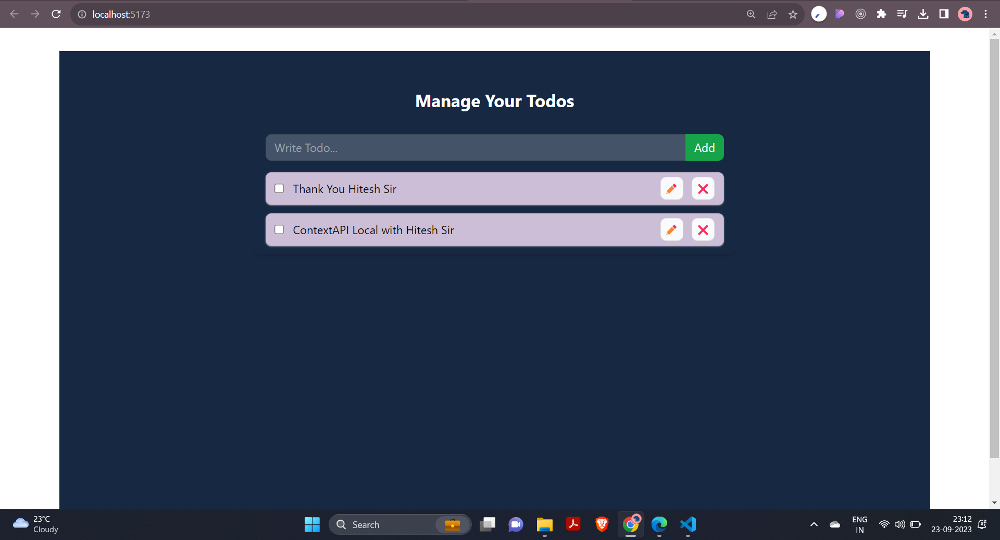

# Todo App with Vite React and Context API

This is a simple todo app built with Vite React, showcasing various React hooks and concepts such as `useState`, `useEffect`, and the Context API. This app allows you to add, edit, complete, and delete tasks.

# [Click Here to see Live Preview ](https://shubhamkolape.github.io/Todo-with-Context-API/)

## Features

- Add new todos.
- Edit existing todos.
- Mark todos as completed.
- Delete todos.
- Persistent storage of todos using `localStorage`.

## Getting Started

## Usage

- **Add a New Todo:** Enter the task in the input field and click the "Add" button.

- **Edit Existing Todo:** Click the edit icon (✏️) next to the todo. Make your changes and click the edit icon again to save your changes.

- **Mark Todo as Completed:** Click the checkbox next to the todo.

- **Delete a Todo:** Click the delete icon (❌) next to the todo.

- **Automatic Persistence:** Your todos are automatically saved and will persist across page refreshes.

## Code Overview

### `App.js`

- The main component responsible for rendering the todo list and providing a context for managing todos.

- Utilizes React hooks such as `useState` and `useEffect` for managing todos and handling local storage.

### `TodoForm.js`

- Handles the addition of new todos. It utilizes the `useState` hook to manage the todo input field.

- Invokes the `addTodo` function when the user submits a new todo.

### `TodoItem.js`

- Represents an individual todo item.

- Manages the todo's edit mode and message using state variables and the `useState` hook.

- Provides functionality to mark todos as completed (`todoComplete`) and delete them (`deleteTodo`).

- Uses the `updateTodo` function to save changes to a todo.

### `TodoContext.js`

- Exports the `TodoContext` and `TodoProvider`, facilitating global state management of todos through the Context API.

### `useTodo.js`

- A custom hook, `useTodo`, simplifying access to the todo context throughout the app.

## License

This project is licensed under the MIT License. See the [LICENSE](LICENSE) file for details.

 ## Acknowledgments

I would like to express my gratitude to my teacher [Hitesh Sir](https://www.linkedin.com/in/hiteshchoudhary/) for their guidance and support during the development of this password generator app. Their expertise and assistance have been invaluable in helping me create this project.

